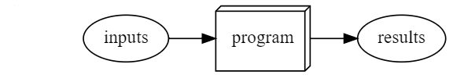
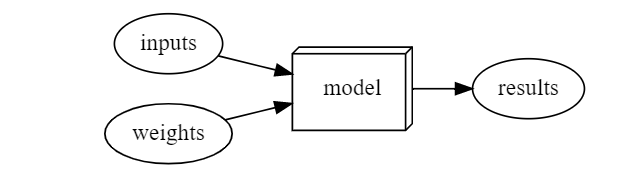
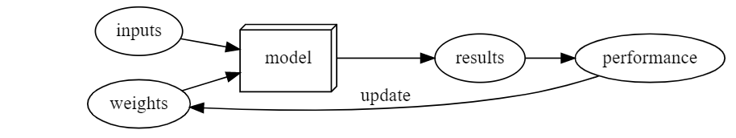
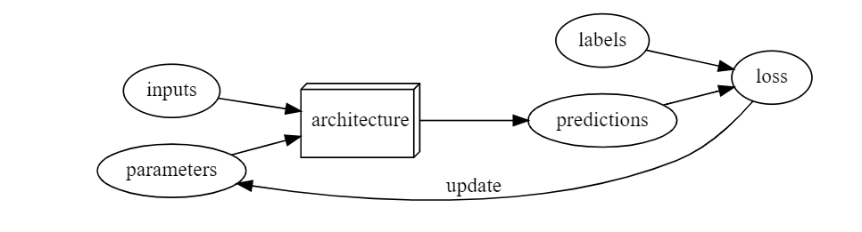
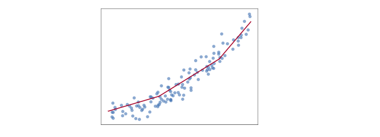
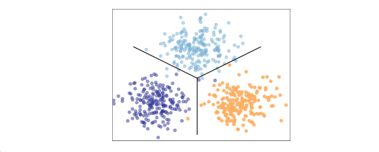
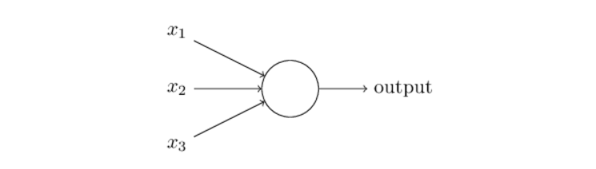
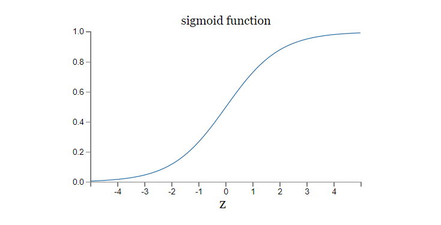
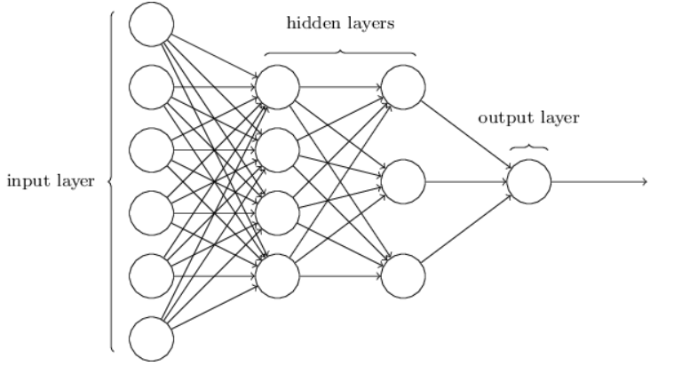

# Deep Learning Mechanics

## I - Basic concepts

**_Machine learning_** is, like regular programming, a way to get computers to complete a specific task. However, unlike ordinary programming where we need to specify exact steps to solve a problem (algorithm), with machine learning we are trying to define a program not by writing it entirely ourselves, but by making computer learn from data. **_Deep learning_** is a specialty within machine learning that uses **_neural networks with multiple layers_**. Image classification is a representative example (also known as image recognition). We start with labeled data; that is, a set of images where we have assigned a label to each image indicating what it represents. Our goal is to produce a program, called a model, which, given a new image, will make an accurate prediction regarding what that new image represents. 

**_Model_** is a special kind of program that can do many different things, depending on the **_weights_** (generally refered to as model **_parameters_** these days). It can be implemented in many different ways. In this architecture, we have data (images of dogs and cats) and weights that are inputs to a model that outputs some results. Results are checked against the performance and they serve as a feedback that changes weights automatically. The goal is to find weights that give the best performance w.r.t a given task.

Ordinary Program |  Deep Learning Model / Machine Learning Model | Model Learning Architecture
:-------------------------:|:-------------------------:|:-------------------------:
  |   | 

**Machine Learning: The training of programs developed by allowing a computer to learn from its experience, rather than through manually coding the individual steps.**

**_Neural network_** is a mathematical function, that is extremely flexible depending on its weights. A mathematical proof called the **_universal approximation theorem_** shows that this function can solve any problem to any level of accuracy, in theory. The fact that neural networks are so flexible means that, in practice, they are often a suitable kind of model, and you can focus your effort on the process of training them—that is, of finding good weight assignments. Additionally, in order to automatically update weights based on the performance of a neural network we use so-called **_stochastic gradient descent (SGD)_**.

Deep learning terminology:

- The functional form of the model is called its architecture (sometimes people use model as a synonym of architecture, so this can get confusing).
- The weights are called parameters.
- The predictions are calculated from the independent variable, which is the data not including the **_labels_**.
- The results of the model are called **_predictions_**.
- The measure of performance is called **_the loss_**.
- The loss depends not only on the predictions, but also the correct labels (also known as targets or the dependent variable); e.g., "dog" or "cat."



Every model starts with a choice of architecture, a general template for how that kind of model works internally. The process of training (or fitting) the model is the process of finding a set of parameter values (or weights) that specialize that general architecture into a model that works well for our particular kind of data. In order to define how well a model does on a single prediction, we need to define a loss function, which determines how we score a prediction as good or bad.

To make the training process go faster, we might start with a pretrained model - a model that has already been trained on someone else's data. We can then adapt it to our data by training it a bit more on our data, a process called **_fine-tuning_**.

When we train a model, a key concern is to ensure that our model generalizes—that is, that it learns general lessons from our data which also apply to new items it will encounter, so that it can make good predictions on those items. The risk is that if we train our model badly, instead of learning general lessons it effectively memorizes what it has already seen, and then it will make poor predictions about new images. Such a failure is called **_overfitting_**. In order to avoid this, we always divide our data into two parts, the **_training set_** and the **_validation set_**. We train the model by showing it only the training set and then we evaluate how well the model is doing by seeing how well it performs on items from the validation set. In this way, we check if the lessons the model learns from the training set are lessons that generalize to the validation set. In order for a person to assess how well the model is doing on the validation set overall, we define a **_metric_**. During the training process, when the model has seen every item in the training set, we call that an **_epoch_**.


You should nearly always use a pretrained model, because it means that your model, before you've even shown it any of your data, is already very capable. Using a pretrained model for a task different to what it was originally trained for is known as **transfer learning**.

All these concepts apply to machine learning in general. That is, they apply to all sorts of schemes for defining a model by training it with data. What makes deep learning distinctive is a particular class of architectures: the architectures based on neural networks. In particular, tasks like image classification rely heavily on convolutional neural networks.

**_Classification_** and **_Regression_** have very specific meanings in machine learning. A classification model is one which attempts to predict a class, or category. That is, it's predicting from a number of discrete possibilities, such as "dog" or "cat." A regression model is one which attempts to predict one or more numeric quantities, such as a temperature or a location.

Regressors draw curves through the data |  Classifiers draw curves through the space separating classes
:-------------------------:|:-------------------------:
  |   

## II - Basic Neuron Models

### Perceptron

**_Perceptron_** is a type of **_artificial neuron_**. A perceptron takes several binary inputs, x<sub>1</sub>, x<sub>2</sub> ... x<sub>n</sub> and produces a single binary output:



Every input has an associated weight w<sub>i</sub> with it. In the example above the perceptron has three inputs - x<sub>1</sub>, x<sub>2</sub>, x<sub>3</sub> and three weights w<sub>1</sub>, w<sub>2</sub>, w<sub>3</sub>. In general it could have more or fewer inputs. Output is calculated as:

```
output = x1*w1 + x2*w2 + ... + xn*wn
output = output > bias
```

In other words:

```
output = x1*w1 + x2*w2 + ... + xn*wn + bias > 0
```

Finally, we can write the output in a more compact way using a dot product:

```
output = w * x + bias

where: 

- w is a vector of weights
- x is a vector of inputs
- bias is a number
- `*` represents dot product between two vectors
```

The bias is a measure of how easy it is to get the perceptron to fire. For a perceptron with a really big bias, it's extremely easy for the perceptron to output a 1. But if the bias is very negative, then it's difficult for the perceptron to output a 1

### Sigmoid Neuron

Today, it's more common to use other models of artificial neurons - **_sigmoid neurons_**. Sigmoid neurons are similar to perceptrons, but modified so that small changes in their weights and bias cause only a small change in their output. In other words, the output is not binary but continuous between 0 and 1. That's the crucial fact which will allow a network of sigmoid neurons to learn.

```
z = w * x + bias, same as for perceptron
sigmoid_neuron_output = 1 / (1 + e^(-z))

where: 

- w is a vector of weights
- x is a vector of inputs
- bias is a number
- `*` represents dot product between two vectors
```



**Note**: Input vector x can have any kind of value (not just binary), the same goes for the output of the sigmoid neuron

## III - The Architecture of Neural Network

Connecting multiple neurons and arranging them in layers creates an architecture of the neural network. The leftmost layer of the network depicted below is called the _input layer_, and the neurons within the layer are called input neurons. The rightmost or _output layer_ contains the output neurons, or, as in this case, a single output neuron. The middle layer is called a _hidden layer_, since the neurons in this layer are neither inputs nor outputs. 



In this neural network, the output from one layer is used as input to the next layer. Such networks are called _feedforward_ neural networks. How does feedforwarding work? Let's assume that we are dealing with sigmoid neurons (delta(z) = 1 / (1 + e^(-z))). 

The input layer only has _activations_ (without biases). To calculate activations in the second layer we will use:

```
z = w1(4x7) * activations1(7x1) + bias1(4x1)
activations2 = 1 / (1 + e^(-z)) 

where:

- activations2 are activations in the layer 2 of this network
- w1(4x7) is a matrix of weights between input and the second later of the network
- activations1(7x1) is a vector of activations in the input layer
- bias1(4x1) is a vector of biases in the second layer
```

Similarly, activations in the third layer are calculated as:

```
z = w2(3x4) * activations2(4x1) + bias2(3x1)
activations3 = 1 / (1 + e^(-z)) 

where:

- activations3 are activations in the layer 3 of this network
- w2(3x4) is a matrix of weights between the second and the third layer of the network
- activations2(4x1) is a vector of activations in the input layer
- bias2(3x1) is a vector of biases in the third layer
```

## IV - Neural Networks Learning

We'll use the notation  to denote a training input. It'll be convenient to regard each training input  as a n - dimensional vector. The desired output will be . For instance, if  is a 28x28=784 picture representing 7, then the ideal output of the network should be  

What we'd like is an algorithm that lets us find weights and biases so that the output from the network is as close as possible to the ideal output  for all training inputs . To quantify how well we're achieving this goal we define a **cost function**. The cost function should output a high value (scalar) if our network is not sure how to recognize digits and low value when the network is confident that it can recognize digits correctly.


The function above can be our cost function for this example. In this function,  represents all weights in the network,  represents all biases in the network,  is the vector of outputs from the network when  is input, and the sum is over all training inputs, . We'll call C _the quadratic cost function_; it's also sometimes known as the _mean squared error_ or just **MSE**.

The cost  becomes small, i.e.,  ≈ 0, precisely when  is approximately equal to the output, , for all training inputs, . So our training algorithm has done a good job if it can find weights and biases so that  ≈ 0. By contrast, it's not doing so well when  is large - that would mean that  is not close to the output  for a large number of inputs. So the aim of our training algorithm will be to minimize the cost  as a function of the weights and biases. In other words, we want to find a set of weights and biases which make the cost as small as possible. We'll do that using an algorithm known as **gradient descent**.

To explain the intuition behind gradient descent we will start with the function . The gradient is a vector of all partial derivatives of a function:


When we calculate the gradient we get:


What does the gradient tell us? When we are at the point (x,y) it explains in which **DIRECTION (not value)** (2x, 2y) we need to go in order to maximize the impact on the function C(x, y). Hence, when we take the negative gradient we are going in a direction to minimize the loss/cost function.

How does this translate to our neural network? Well, our cost function  has a lot of parameters but in the end, it's just a multivariable function. We can randomly choose  and  and calculate the gradient at that point of a cost function. The gradient will tell us in which direction we should go in order to reduce the value of a cost function. In order to go downhill, we will need some learning step that will represent how fast we want to go downhill. If steps are small, then learning process will be slow. If steps are high, then we might never find a minimum.

The gradient is actually averaged over all training examples. This means that we calculate gradient for one training example  and note what changes of  and  should be in order to improve the cost function for this example. We need to do this for every training example and find the average value of individual changes in order to make a new step in the cost function. This process is costly. So, we are going to use **stochastic gradient descent** that will take batches of input training data and make gradient descent based on those batches (we are essentially making an approximation of a true gradient using this batch approach). Of course, the estimate won't be perfect - there will be statistical fluctuations - but it doesn't need to be perfect: all we really care about is moving in a general direction that will help decrease C, and that means we don't need an exact computation of the gradient. In practice, stochastic gradient descent is a commonly used and powerful technique for learning in neural networks.
